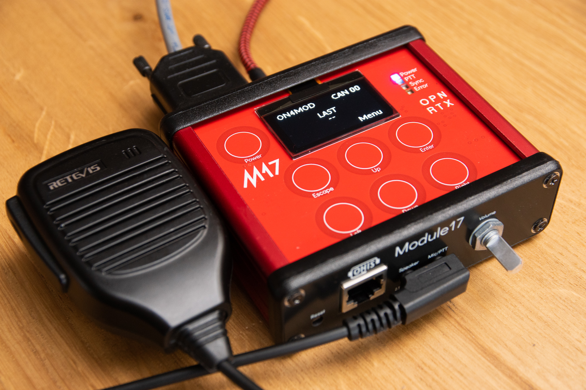
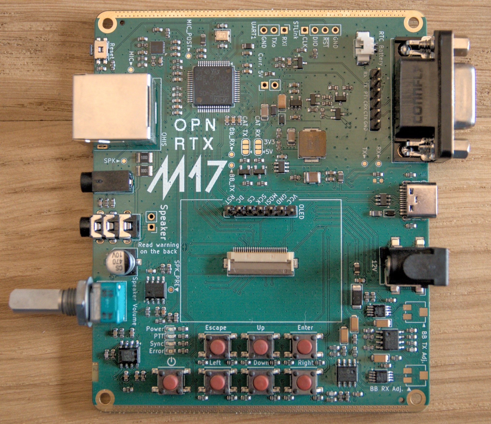
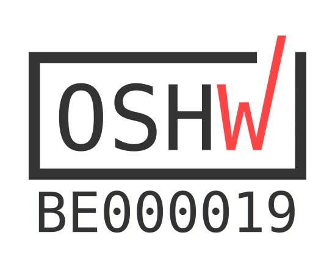

# Module 17
Welcome to Module 17 repository!

This project provides a standalone modem that transforms any 9600 baud capable transceiver into an [M17](https://m17project.org/) compatible radio. It is based on a STM32F4 microcontroller and is designed to run the [OpenRTX](https://openrtx.org/) firmware. Audio and PTT connectivity is given through a "Kenwood 2 Pin" compatible connector (2.5 and 3.5mm audio jacks) or an [OHIS](https://ohis.org/) connector (this is **NOT** an internet connector). Power supply of 6 to 15 volts can be applied through a 5.5/2.5mm DC plug.

    

Several boards of various revisions have been built. The latest one is rev 1.0. This revision went through a complete board re-design, mainly to make it compatible with an aluminium extruded enclosure. It does however remain very similar in principle to the previous revisions. Other changes such as audio input and output improvements were made in this revision.

Revision 1.0 boards can be ordered partially or even fully assembled at [PCBWay](https://www.pcbway.com) with the manufacturing data in this repository. Some parts such as the digital potentiometers, the DC-DC converter inductor or the audio power amplifier may not (always) be in stock. Fortunately, they are almost always available through Mouser/Digikey. JLCPCB can acquire them through their global sourcing program if you are willing to use it.

## Versions
The current revision (rev 1.0) is available in two different versions:
- Enclosure with additional board for the user interface (called HMI, see picture above)
- Bare board (similar to how revisions 0.1d/e were used)
    

    
    

The board can be switched from one version to another relatively easily. To convert a bare board to an enclosed version, the screen needs to be removed and a few additional PCBs need to be ordered (see the [Ordering guide](./docs/order.md)).

You can of course always 3D-print an enclosure for your bare board.

## Getting Started
The very first step is to get a board. The board is not available for sale yet. Head over to the [Ordering guide](./docs/order.md) to get a board. If you want to assemble the board with the designed enclosure and HMI, follow the instructions from the [enclosure instructions](./docs/enclosure.md).

Otherwise, if you just obtained a Module17 board, you may want to:

1. Flash it with OpenRTX, the officially supported firmware [Details](./docs/flashing.md)
2. Configure OpenRTX settings [Details](./docs/quickstart.md#configure-openrtx)
3. Connect the board to a radio. The DE-9 connector at the top of the board can be used to connect Module17 to a 9600baud radio. The pinout is shown in the table below.

| Pin      |             Function             |             Direction            | `CT-167` cable wire color |
|----------|:--------------------------------:|----------------------------------|---------------------------|
| 1        |  unused (floating)               |  --                              |                           |
| 2        |  baseband output (towards radio) |  output                          |  brown                    |
| 3        |  CAT-RX                          |  input                           |                           |
| 4        |  CAT-TX                          |  output                          |                           |
| 5        |  radio PTT                       |  output, open-drain, low-active  |  red                      |
| 6        |  baseband input (from radio)     |  input                           |  orange                   |
| 7        |  unused (floating)               |  --                              |                           |
| 8        |  ground                          |  --                              |  black, thick             |
| 9        |  12V input                       | input (supply)                   |                           |
4. Adjust the baseband levels for your specific transceiver [Details](./docs/quickstart.md#adjusting-the-baseband-levels)

A list of tested transceivers is [here](https://wiki.m17project.org/radio_compatibility).

## Building the firmware yourself
Building instructions are available [at the OpenRTX project's website](https://openrtx.org/#/compiling).

## Features
The board contains many features, some of which you may never use. Here is a list:
- [Rev 1.0](./docs/features.md)
- [Rev 0.1d/e](../1e29440208ae519b9b4e89094e34ecb27943ad3d/README.md#usage-rev-01de)

## Acknowledgments
This project is inspired by David Rowe's [SM1000](https://www.rowetel.com/wordpress/?p=3125) "smart microphone".

## License
Module 17 hardware is licensed under the [CERN Open Hardware License - Weakly Reciprocal](https://ohwr.org/cern_ohl_w_v2.txt)

Module 17 is certified by OSHWA under ID BE000019. 
