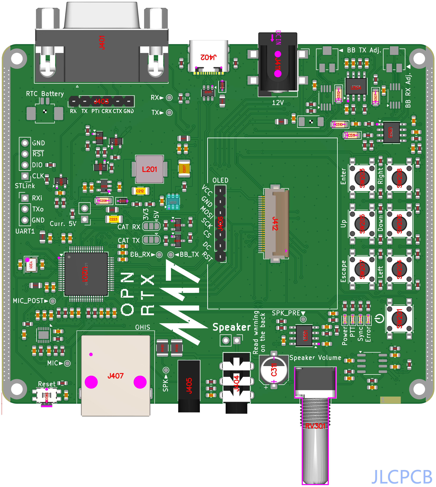
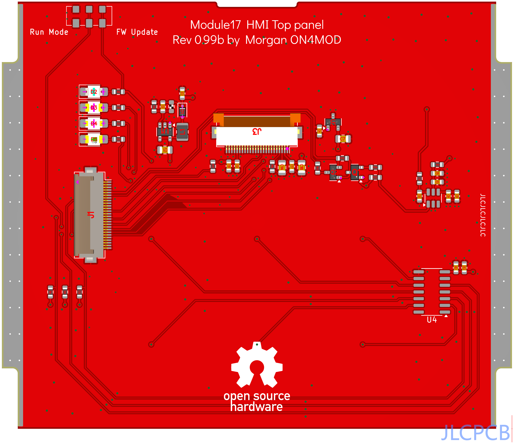

# Ordering guide for Module17

This guide explains how to order Module17 boards on JLCPCB. JLCPCB is one of the websites that provides PCB assembly services to customers in small series. Other websites do provide the same services and you would have to adapt those instructions (though the general process will stay the same).

The process to order the board is quite simple :
- You upload the manufacturing files to the manufacturers website
- You configure the order to produce the boards correctly
- You upload a list of components and their positions on the board
- You fix the components placement and the parts numbers
- You receive the boards (and solder a few additional components if needed)

The first four steps have to be repeated for each board that you want to order. You will usually order the mainboard in all cases. You can additionally order the HMI and front/back panels if you want to use the [designed enclosure](./enclosure.md). The side panels only require the first two steps as they do not contain any components.

If you want to use the bareboad version with only the mainboard, you will also need an additional screen from Waveshare ([Waveshare 18179](https://www.waveshare.com/1.3inch-oled-module-c.htm))

## Production files

You will first need to locate the production files as you will have to upload them on JLCPCB website. 

* Mainboard files are located in [`Module_17/hardware/mainboard/production/`](../hardware/mainboard/production):
    * [`Module17_Rev_1.0.zip`](../hardware/mainboard/production/Module17_Rev_1.0.zip) contains the gerber files (the PCB fabrication files)
    * [`bom_digipot.csv`](../hardware/mainboard/production/bom-digipot.csv) contains the bill-of-materials, the list of components needed
    * [`positions_digipot.csv`](../hardware/mainboard/production/positions-digipot.csv) contains the position of all the components to assemble on the board (also called CPL file)

    Note: Both the BOM and positions files have a `-multiturn` variant that is to be used if you want to use the multiturn potentiometers for the baseband tuning instead of the digital potentiometers (see [below](./order.md#mainboard))

* HMI files are located in [`Module_17/hardware/HMI/production/`](../hardware/HMI/production):
    * [`Module17_HMI_Rev_1.0.zip`](../hardware/HMI/production/Module17_HMI_Rev_1.0.zip) contains the gerber files (the PCB fabrication files)
    * [`bom.csv`](../hardware/HMI/production/bom.csv) contains the bill-of-materials, the list of components needed
    * [`positions.csv`](../hardware/HMI/production/positions.csv) contains the position of all the components to assemble on the board (also called CPL file)

* Side panels files are located in [`Module_17/hardware/side_panels/production/`](../hardware/side_panels/production):
    * [`Module17_HMI_Front_Panel_Rev_1.0.zip`](../hardware/side_panels/production/Module17_HMI_Front_Panel_Rev_1.0.zip) contains the gerber files for the front panel
    * [`Module17_HMI_Back_Panel_Rev_1.0.zip`](../hardware/side_panels/production/Module17_HMI_Back_Panel_Rev_1.0.zip) contains the gerber files for the back panel

## Ordering

For each board that you want to order, follow the following instructions. Additional, **important** board-specific instructions are provided below. 

- Navigate to [https://cart.jlcpcb.com/quote](https://cart.jlcpcb.com/quote) 
- Click on "Add gerber file" and upload the zip file containing the gerber files (PCB fabrication files)
- Once the files are uploaded, ensure the correct settings are selected for the board you are ordering (the settings differ for the main board, HMI and side panels, see below)
- If you selected the "PCB Assembly" option, click next, otherwise, click "Save to cart" and you are done

The following instructions are for PCB Assembly:
- Select the "Bill of Materials" tab above the picture of the PCB
- Click "Add BOM File" and select the `bom.csv` file corresponding to the board you are ordering
- Click "Add CPL File" and select the `position.csv` file corresponding to the board you are ordering
- Click "Process BOM & CPL"
- ***VERY IMPORTANT:*** check that the correct components are selected by JLCPCB. You will most probably need to do a few adjustments (see below for board-specific instructions)
- Click Next. If JLCPCB shows a pop-up saying "Project has unselected parts" click "Do not place". If you did not intend to order the board with these parts then it is alright. Otherwise, you will need to order those parts elsewhere and solder them by hand once you received the partially assembled boards
- If JLCPCB then says that "The system detects component that may be offset from the PCB" click "Ok"
- Carefully check that all the components on the board are placed correctly. See the instructions below for an example picture
- Click "Next" and check the overview of you order
- Click "Save to Cart"

# Board-specific instructions

## Mainboard

The mainboard is the core part of Module17. They are several variations that are possible:

* **Digital potentiometers vs multiturn potentiometers**: Depending on your preferences and/or the parts availability, you may want to choose digital potentiometers (configured at runtime in OpenRTX) or the multiturn potentiometers. The performances of the board will be the same anyway

* **If you do not plan on using the bare motherboard** i.e. if you only plan to use the board with the designed enclosure and HMI, you can choose not to assemble the following components to reduce the cost:
    - J406
    - SW202-208
    - D204-207

* **If you do not plan on using the designed enclosure and HMI**: you can choose not to assemble the following component:
    - J412

* Depending on the [features](./features.md) that you want, you may wish to assemble (or not) the following components:
    - J413 for the RTC
    - J408 for the STLink debugger
    - J409 for the UART 
    - J403 to break out the signals from the packet-radio connector

### PCB settings

It is recommended to order the PCB by selecting the following parameters:
- PCB Color: Green will usually be the cheapest and fastest option. But feel free to chose any other color you want.
- Material Type: FR-4 TG155
- Surface Finish: ENIG
- Remove Order Number: Specify a location
- PCB Assembly: tick the box (given the number of components and their size, it is highly recommended to let JLCPCB assemble the board. Assemble it yourself only if you know what you are doing)
    - Select "Assemble top side"
    - PCBA Type: Economic (if you can not select Economic, then the color you have chosen may be incompatible with the Economic option. This will result in an increased price but the rest of the process stays the same)

### Bill of Material

It is advised to pay attention to these components when ordering:

* The components selected for some of the **10 nF capacitors** (C304, C315, C503, C505, C506, C508), the **680pF capacitors** (C504, C509), 1.5nF capacitor and some of the **100 nF capacitors** (C306, C308, C309, C310, C401, C501, C502)  can be matched by JLCPCB with components using X7R dielectric. It is advised to use C0G dielectric capacitors.

* **The LEDs** (D204-207) are pre-populated by JLCPCB with RED leds. You should change the components selected for the blue (power), green (sync) and orange (error) LEDs.

* Check that the **crystal** pre-populated by JLCPCB is designed to run with a 12pF capacitive load. Make sure to pick a crystal with a tolerance of 10ppm.

* The tactile switches pre-selected in the BOM may not be available. You can pick another switch from the PTS645 series of surface-mount tactile switches (PTS645-S-\*-\*\*-SMTR92). This can also help reduce the cost of the BOM depending on the prices at the time of ordering.

* D203, D401 are supposed to be BAT60A diodes but those can sometimes be hard to find. You can replace those with other low-Vf Schottky diodes, most notably the 1N5819WS (JLCPCB ID: C191023) is a basic part at JLCPCB (no additional fees) that is easily available.

* U501, U502 are the digital potentiometers for the baseband filters. If those are not available, you can either opt for the version with multiturn potentiometers, or order those components somewhere else. They are not that hard to solder by hand

* IC301 is the audio power amplifier. This can be ordered somewhere else and assembled by hand.

### Components placement

Here is a picture of the components placement on a board ready to be ordered:
    

        
    

Some of the big components may be visibly offset/rotated from their intended positions. But some smaller components may also be rotated from their intended position. To check that, make sure that the small white triangle printed on the board matches the pink dot in the corner of the component.

## HMI

The HMI is the additional user interface that will slide in the enclosure and contains the screen, LEDs and capacitive (tactile) switches.

### PCB settings

It is recommended to order the PCB by selecting the following parameters:
- PCB Color: Red will usually be the nicest-looking option. But feel free to chose any other color you want.
- Material Type: FR-4 TG155
- Surface Finish: "HASL (with lead)" is the cheapest option. You can select any other option if you wish.
- Via covering: "Epoxy Filled & Capped" will make the board look much nicer. You can choose "Plugged" if you want to spare a few bucks, but beware that the board will be riddled with tiny holes. 
- Remove Order Number: Specify a location
- PCB Assembly: tick the box (given the number of components and their size, it is highly recommended to let JLCPCB assemble the board. Assemble it yourself only if you know what you are doing)
    - Select "Assemble **bottom** side"
    - PCBA Type: Standard (at the time of writing, JLCPCB does not support Economic assembly for 4-layers board that are any other color than Green. If this option is available to you at the time of ordering, then select Economic to save a bit of money)

### Bill of Material

It is advised to pay attention to these components when ordering:

* R1 is often matched to a 1.3 Mohm resistor instead of a 1.37 Mohm resistor

* D1 is supposed to be a BAT60A diode but those can sometimes be out-of-stock. You can replace it with other low-Vf Schottky diodes, most notably the 1N5819WS (JLCPCB ID: C191023) is a basic part at JLCPCB (no additional fees) that is easily available.

* SW9 is often out-of-stock. This component can be ordered somewhere else and soldered by hand.

* U3 and U4 are not part of JLCPCB's catalog (at least at the time of writing this). Those have to be ordered somewhere else and can easily be soldered by hand (full parts numbers: U3: IQS211B00000000TS; U4: CAP1206-1-SL)

### Components placement

Here is a picture of the components placement on a board ready to be ordered:
    

        
    

You may need to select the bottom side of the board in the top right corner of the GUI.
Some smaller components may be rotated from their intended position (the LEDs are often mounted in the wrong way (top-left corner)). To check that, make sure that the small white triangle printed on the board matches the pink dot in the corner of the component. For the LEDs the '-' of the component should be on the side of the "inside" of the "U" painted around the component.

## Side panels

The side panels are smaller boards that are used as front and back plates.
No components are mounted on those boards.

### PCB Settings

It is recommended to order the PCB by selecting the following parameters:
- PCB Color: Black will usually be the nicest-looking option. But feel free to chose any other color you want.
- Remove Order Number: Specify a location